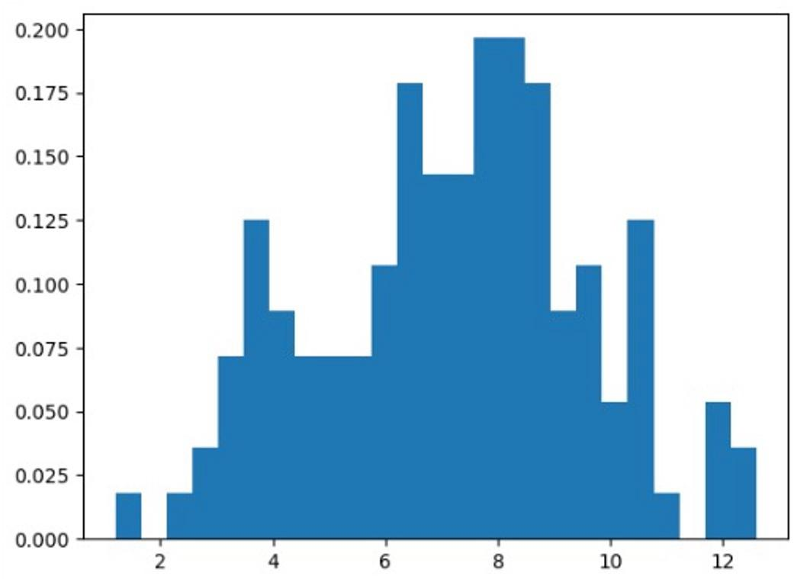
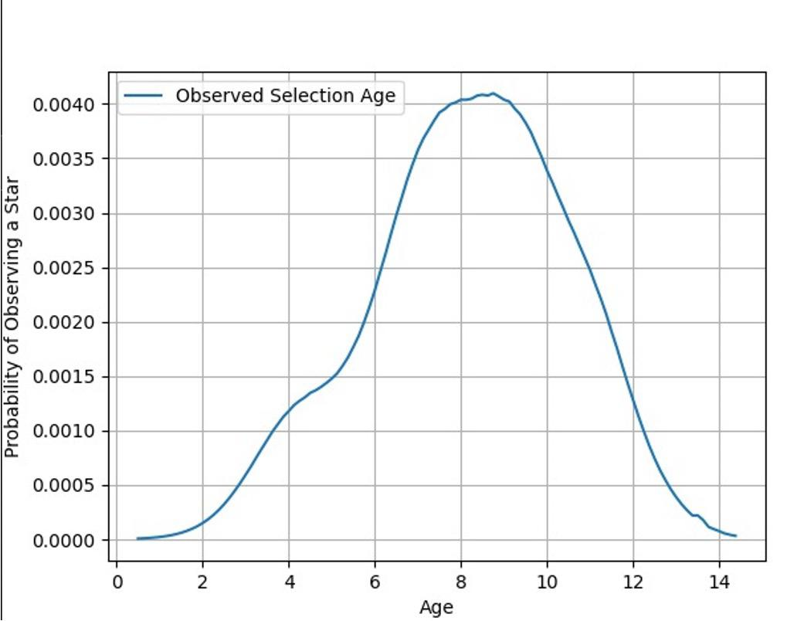
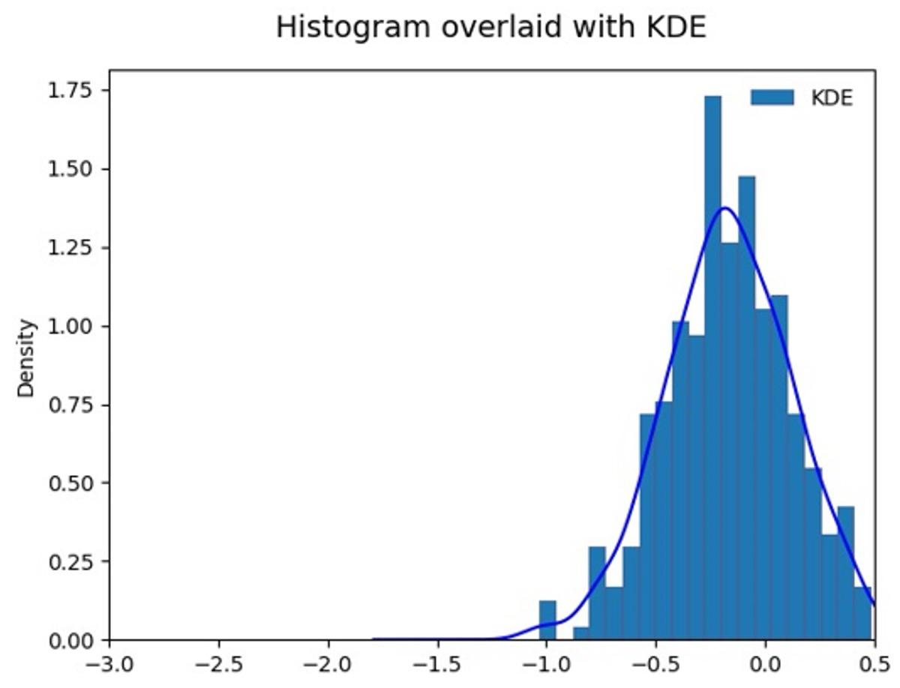
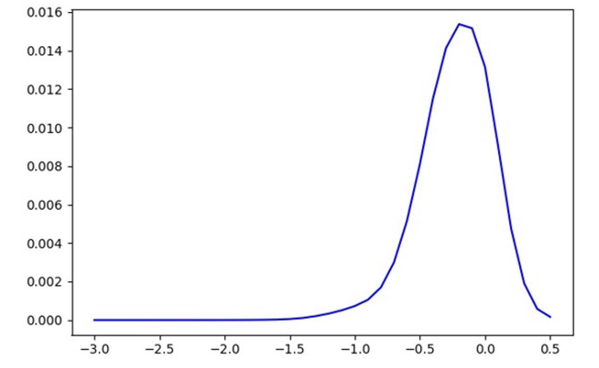

# OPACOS

The framework developed is useful in order to get the probability distribution of parameter of stars in Milky Way as observed by us synthetically for a section of our Sky. Using above framework we can get the ditribution function of parameters for a section of sky which can be used as a prior in Galactic surveys.

Our framework can be used to get the probability distribution of metallicity or age given priors of (age,distance) or (metallicity, distance) respectively. It accounts for selection effects and generates a probabilty distribution of parameters as would be seen by us for a section of sky.

The above framework is divided into two components:
- The first component which uses the extinction code ALextin and the probability calculation code that we created and calculates the probability of observing stars.
- The second component which uses the probability along with the GALAXIA code results in order to simulate the parameter distribution of stars that we would observe. Here GALAXIA is a simulation code which simulates the Galaxy for us which we sample for pur use.

<h2>Installation:</h2>

Download the zip file in the desired folder.

- Unzip the file using command:

   ```tar gz -xvf OPACOS-main.zip```
- After doing it follow the documentation as mentioned ahead in-order to install the GALAXIA code: https://galaxia.sourceforge.net/
- Open the **galaxy1.py** file and change the data variable to:

   ```data = ebf.read('/user/GalaxiaData/Examples/galaxy1.ebf','/')```
   
  here instead of user you will set the location of the GalaxiaData folder that you installed in the last step. The **galaxy1.py** file uses the GALAXIA code results stored in **galaxy1.ebf** files , reads it and stores the appropriate parameters useful for us in the **galaxia.dat** file.
  
- Refer to **Survey_DATA.dat** file and install the data files as mentioned in it as it would be used to extract data to be worked on. Install both the files in the main directory that is just outside **Survey_DATA.dat** file.

<h2>Running OPACOS:</h2>

To Run OPACOS it is quite straightforward, although sooner we will further streamline the process. To run OPACOS we need to do folow following steps:

- Generate the stars in Milky Way galaxy using GALAXIA. To do that go inside GalaxiaData folder that must have been created as mention in GALAXIA doxumentation. Then go to Examples and open **myparameterfile** in it. Once it is open set the location of the center of the cone that you want to simulate the stars in along with the area that you are interested in. 
- Make sure that the circular patch option is selected instead of all sky survey in **myparameter** file.
- After setting that run ```galaxia -r myparameterfile``` command in terminal inside the Examples folder to generate stars of galaxy which is stored in **galaxy1.ebf** file.
- Now you need to go to the main folder where you downloaded OPACOS and run:

  ```python galaxy1.py```
  
- Read the **data_cube.py** file and keep the the selection effects settings and other settings according to your survey and region of interest. 
- After reading the **data_cube.py** and keeping the required settings then run:
  
  ```python data_cube.py```
  
- After doing this we are done with the probability calaculation grid and it is stored in **results.dat** file. This probability grid will be used along with galaxy data stored in **galaxia.dat** in order to get the required parameter distribution.

- Now what is left is to go through the **Read_fits.ipynb** to get the priors as discussed in the introduction. 
- Go through the **Read_fiits.ipynb** and set the center coordinates of the sky for the cone of interest. We also change the area, both the changes are to be done as we have set the settings while simulating galaxy that is same values as that in **myparamterfile**.
- After going through all the tabs you need to use the **age_distance** and **feh_distance** arrays and replace the old arrays in **Calculate_pdf.py** .
- **Calculate_pdf.py** code generates both the observed parameter distribution(if you want) and the synthetic paramter distribution through our framework for you too compare and infer from.
- If you want to generate the synthetic age distribution then you need to set **bin_along_distance_feh** value as **True** otherwise **False**.
- Whereas if you want to generate the synthetic metallcity distribution then you need to set **bin_along_distance_age** value as **True** otherwise **False**.
- After setting all the above input settings you can simply go to command line and run:

  ```python Calculate_pdf.py```
  
- At the end you will get the approprite parameter distributions that you require.
- An example of the age distribution is shown below:





The above distributions are calculated keeping around the galactic long. and lat. values as (l,b) = (4.5,-72.5). The fist distribution above is of the GAIA data age distribution whereas the second distribution is the synthetic distribution that we got from our framework.




The above distributions are calculated keeping around the galactic long. and lat. values as (l,b) = (63.0,-12.0). The fist distribution above is of the GALAH feh distribution whereas the second distribution is the synthetic distribution that we got from our framework.


 

