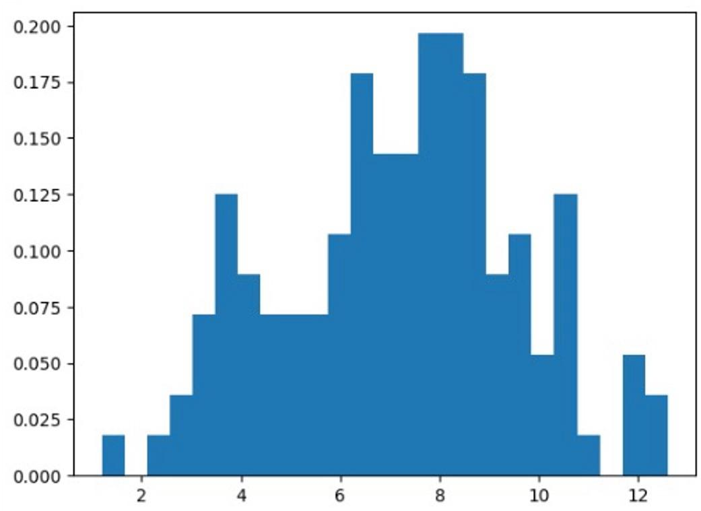
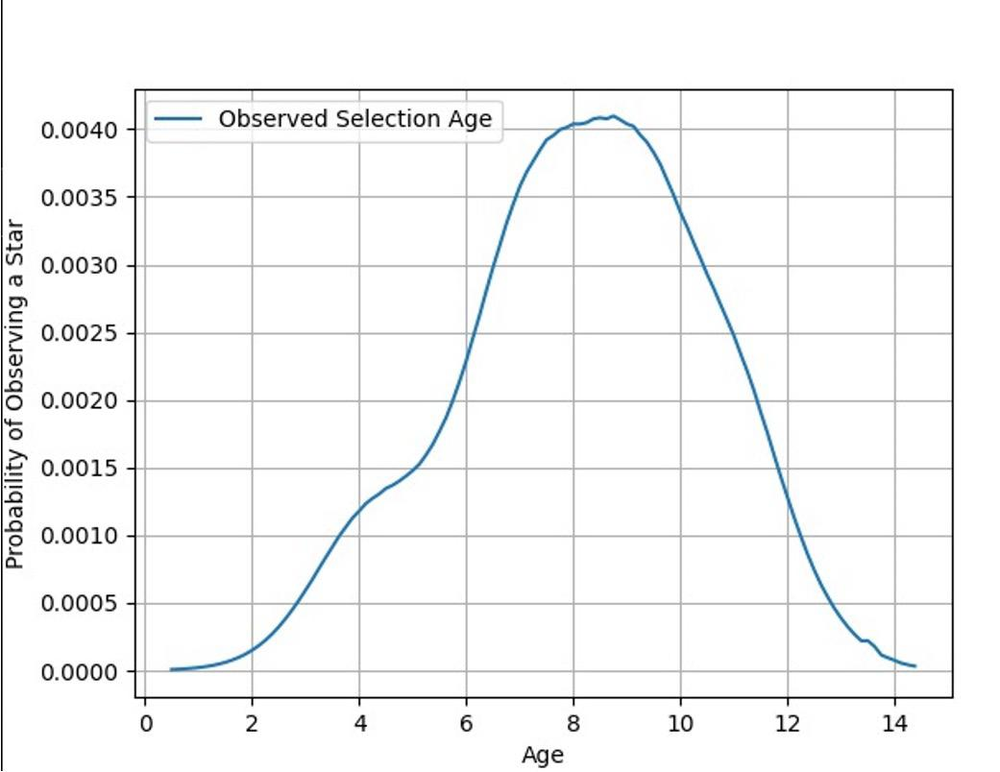
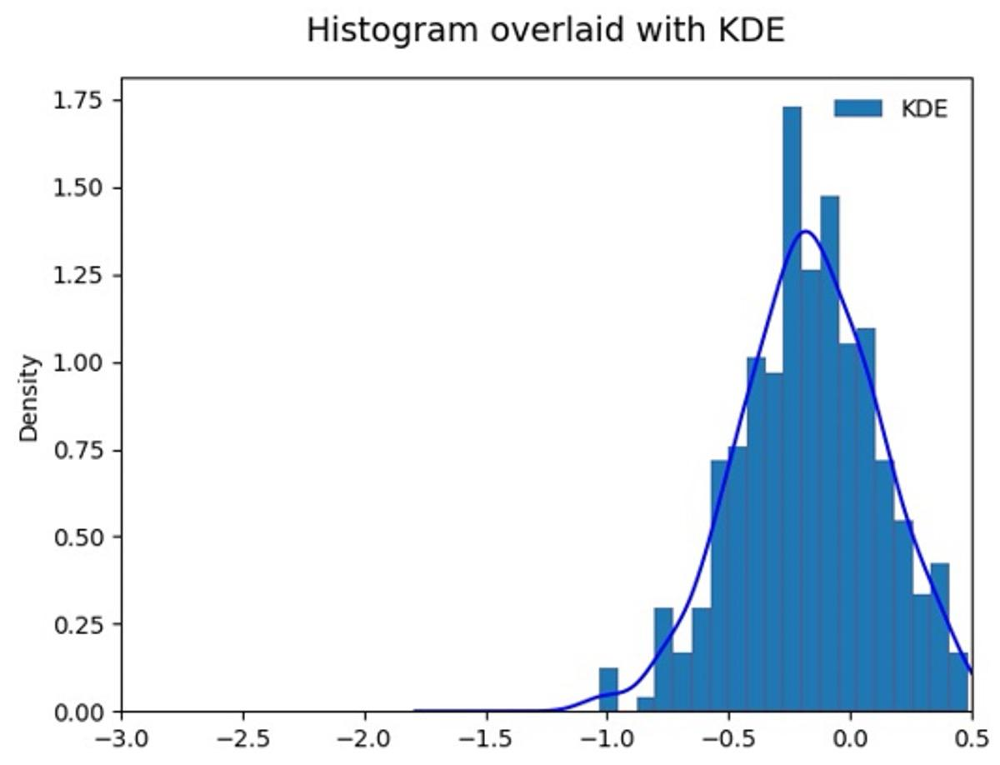
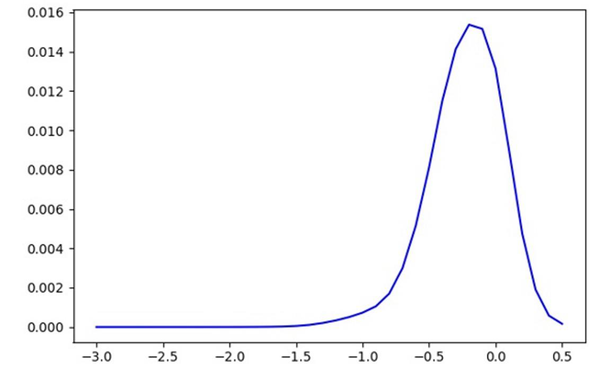

# OPACOS

The framework developed is helpful in getting probability distribution of parameters of stars in the Milky Way as observed by us synthetically for a section of our Sky. Using above framework we can get the ditribution function of parameters for a section of sky which can be used as a prior in Galactic surveys.

Our framework can be used to get the probability distribution of metallicity or age given priors of (age,distance) or (metallicity, distance) respectively. It accounts for selection effects and generates a probability distribution of parameters as would be seen by us for a section of sky.

The above framework is divided into two components:
- The first component which uses the extinction code ALextin and the probability calculation code that we created and calculates the probability of observing stars.
- The second component which uses the probability along with the GALAXIA code results in order to simulate the parameter distribution of stars that we would observe. Here GALAXIA is a simulation code which simulates the Galaxy for us which we sample as per our use.

<h2>Installation:</h2>

Download the zip file in the desired folder.

- Unzip the file using command:

   ```tar gz -xvf OPACOS-main.zip```
- After doing it follow the documentation as mentioned ahead in-order to install the GALAXIA code: https://galaxia.sourceforge.net/
- Open the **galaxy1.py** file and change the data variable to:

   ```data = ebf.read('/user/GalaxiaData/Examples/galaxy1.ebf','/')```
   
  here instead of user you will set the location of the GalaxiaData folder that you installed in the last step. The **galaxy1.py** file uses the GALAXIA code results stored in **galaxy1.ebf** files , reads it and stores the appropriate parameters useful for us in the **galaxia.dat** file.
  
- Refer to **Survey_DATA.dat** file and install the data files as mentioned in it as it would be used to extract data to be worked on. Install both the files in the main directory that is just outside **Survey_DATA.dat** file.

<h2>Running OPACOS:</h2>

<h3><u>1. First Approach (More interactive and experimental in purpose):</u></h3>

To Run OPACOS it is quite straightforward (although more streamline process is available in the next section). To run OPACOS we need to do follow the following steps:

- Generate the stars in Milky Way galaxy using GALAXIA. To do that go inside GalaxiaData folder that must have been created as mention in GALAXIA doxumentation. Then go to Examples and open **myparameterfile** in it. Once it is open set the location of the center of the cone that you want to simulate the stars in along with the area that you are interested in. 
- Make sure that the circular patch option is selected instead of all sky survey in **myparameter** file.
- After setting that run ```galaxia -r myparameterfile``` command in terminal inside the Examples folder to generate stars of galaxy which is stored in **galaxy1.ebf** file.
- Now you need to go to the main folder where you downloaded OPACOS and run:

  ```python galaxy1.py```
  
- Read the **prob_grid.py** file and keep the the selection effects settings and other settings according to your survey and region of interest. 
- After reading the **prob_grid.py** and keeping the required settings then run:
  
  ```python prob_grid.py```
  
- After doing this we are done with the probability calculation grid and it is stored in **results.dat** file. This probability grid will be used along with galaxy data stored in **galaxia.dat** in order to get the required parameter distribution.

- Now what is left is to go through the **Read_fits.ipynb** to get the priors as discussed in the introduction. 
- Go through the **Read_fits.ipynb** and set the center coordinates of the sky for the cone of interest. We also change the area, both the changes are to be done as we have set the settings while simulating galaxy that is same values as that in **myparamterfile**.
- After going through all the tabs you need to use the **age_distance** and **feh_distance** arrays and replace the old arrays in **Calculate_pdf.py** .
- **Calculate_pdf.py** code generates both the observed parameter distribution(if you want) and the synthetic paramter distribution through our framework for you too compare and infer from.
- If you want to generate the synthetic age distribution then you need to set **bin_along_distance_feh** value as **True** otherwise **False**.
- Whereas if you want to generate the synthetic metallcity distribution then you need to set **bin_along_distance_age** value as **True** otherwise **False**.
- After setting all the above input settings you can simply go to command line and run:

  ```python Calculate_pdf.py```
  
- At the end you will get the approprite parameter distributions that you require.
- An example of the age distribution is shown below:





The above distributions are calculated around the galactic long. and lat. values of (l,b) = (4.5,-72.5). The first distribution above is of the GAIA data age distribution whereas the second distribution is the synthetic distribution that we got from our framework.




The above distributions are calculated around the galactic long. and lat. values of (l,b) = (63.0,-12.0). The first distribution above is of the GALAH feh distribution whereas the second distribution is the synthetic distribution that we got from our framework.
Although remember the model distributions are not normalized in the given figures although it does not affect are purpose as long as the shape of distribution accross the range of parameter remains same (In the current system the distributions are normalised).

<h3><u>Second approach (Streamline, faster and easy to use):</u></h3>

This approach is more direct, faster and easier to use for getting model and data distributions along with thier correlations in different portions of sky. For this approach we are also using and comparing the GALAHH $[Fe/H]$ data survey (which is supported by the GAIA DR3 distances and ages data). For this method you have to run only one script by the name **run.sh**. Before coming to this, i will explain the few input arguments that can be modified as per your use in the **run.sh** file :

- You can modify the **galactic_latitude** and **galactic_longitude** parameter in the file. This is used to mark the center of the circular region of interest in sky to be analysed by our framework.

- You can modify **survey_area** parameter in the file. This is used to define the area with **galactic_latitude** and **galactic_longitude** as center, to be analysed by our framework.

- Argument **Phot_sys** can be given as either **'GAIA_EDR3'** or **'2mass'** based on the survey and the selection criteria. Since we are using **GALAH** survey data we have kept the **Phot_sys** to be **'2mass'**.

- The argument **imf_type** can be taken either as **'salpeter'**, **'kroupa'** or **'chabrierlognormal'**. According to latest studies, the 'kroupa' and 'chabrierlognormal' IMFs do not overestimate the number of stars in low mass region unlike the 'salpeter' IMF. Thus we usually prefer the 'kroupa' or 'chabrierlognormal' IMfs but it comes at the cost of longer computation time. The IMFs are required to generate stars to be used with isochrones to calculate the probability of observing a star using **data_cube.py** code.

- The argument **extinction_mode** can be either **out_plane** if the region of interest is out of the galactic plane or **in_plane** otherwise. This is used to derive the extinction using different approaches for stars in galactic plane and for stars out of galactic plane.

- If you want to infer the model age distribution set the argument **age_distribution** to be **True** or otherwise **False**.

- If you want to infer the model $[Fe/H]$ distribution set the argument **feh_distribution** to be **True** or otherwise **False**.

- Additional note : The selection function is specifically taken for GALAH survey data in our case. If you want to modify it you can check it in **data_cube.py** .

Now, after modifying the input settings (mentioned above) as per your interest, you can simply run:

  ```./run.sh```

After this all the resultant plots will be saved in the **RESULTS** folder.

The model and data plots will be same with this and previous approach so, you can refer to the previous section to see the example plots.

I will specifically show an additional plot generated via this approach which is a Q-Q plot comparing the data and  shown below for (l,b) = (270,-73):


The above plot compares the Data age and our model framework age PDF.

The above plot compares the Data $[Fe/H]$ and our model framework $[Fe/H]$ PDF.

We can clearly see an agreement in the data distribution and the model framework distribution in above plots.

<h3><u>Progress to be made in future:</u></h3>

- Although, we see an agreement, we also have to acknowledge that the distributions are sensitive to some loose parameters which are the bin sizes while sampling the GALAXIA model.

- Thus, I am currently working on training the model to determine the loose parameters and this would help us to further rely on the results we get.

- Right now we are only comparing the present Data Age and Model Age, but after training the loose parameters we will also pursue to predict the age or $[Fe/H]$ distributions from our framework as only then we can reliably infer the distributions.


